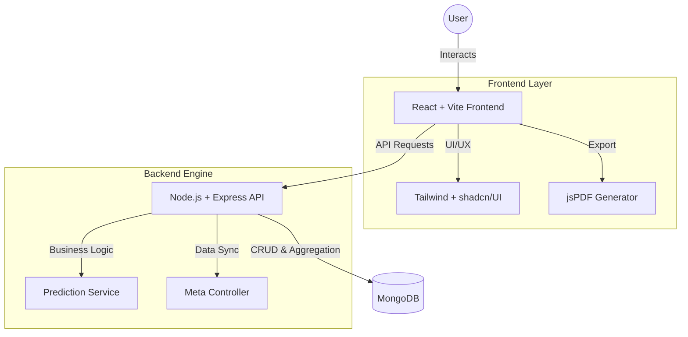
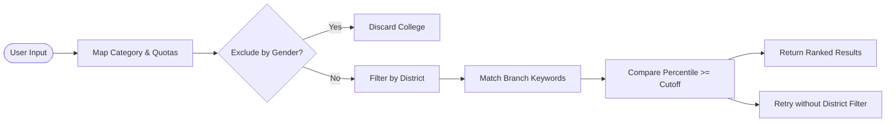

# EduGuide - Advanced College Predictor 🎓

EduGuide is a high-performance, rule-based college prediction system specifically designed for MHT-CET and JEE candidates in Maharashtra. It provides accurate college recommendations based on official CAP cutoff logic, including complex reservation systems and location-based preferences.

## 📖 Project Overview

### What is EduGuide?
EduGuide is a digital assistant designed to help engineering aspirants in Maharashtra navigate the complex college admission process. It simplifies the task of finding the right college by matching a student's exam percentile with historical cutoff data from hundreds of institutions.

### The Problem It Solves
The Maharashtra CAP (Centralized Admission Process) involves over 300+ colleges, dozens of engineering branches, and a multi-layered reservation system (Caste, PWD, Defense, TFWS, Orphan, etc.). For a student, manually checking PDF cutoff lists to find where they are eligible is overwhelming, time-consuming, and prone to error.

### Our Solution
EduGuide provides a **strict, rule-based prediction engine** that:
- **Reduces Search Time**: Instead of scanning hundreds of pages, students get a curated list in seconds.
- **Ensures Accuracy**: By using exact database comparisons (`Percentile >= Cutoff`), it eliminates guesswork.
- **Handles Complex Quotas**: Automatically calculates eligibility for special reservations like PWD, Defense, and TFWS, which are often missed by simpler predictors.
- **Provides Actionable Reports**: Detailed college cards and downloadable PDF reports help students build their final "Option Form" with confidence.

## 📊 Technical Architecture

### System Architecture


### Prediction Logic Flow


## 🚀 Key Features

- **Strict Merit-Based Filtering**: Uses official CAP cutoff data with high-precision percentile matching.
- **Advanced Reservation Quotas**: Full support for PWD, Defense, TFWS, and Orphan reservations integrated with standard caste categories (OBC, SC, ST, NT, EWS).
- **Intelligent Branch Matching**: Smart alias matching for branch preferences (e.g., matches "AI" with "Artificial Intelligence").
- **Smart Location Search**: Multi-select support for all 32 districts in Maharashtra with integrated search.
- **Gender-Based Safety**: Automatic detection and filtering of "Female Only" and "Male Only" institutions.
- **Premium User Experience**: Modern 4-step wizard form built with React + Tailwind CSS + shadcn/UI.
- **Detailed PDF Reports**: Generate and export professional college recommendation reports with full profile details.

## 📁 Project Structure

```text
EduGuide/
├── frontend/   # Vite + React client (TypeScript, Tailwind, shadcn/UI)
├── backend/    # Express API (Node.js, MongoDB/Mongoose)
├── database/   # MongoDB models, seed scripts, and data snapshots
├── docs/       # API documentation and testing assets
└── package.json
```

## 🛠️ Getting Started (Local Development)

### 1. Prerequisites
- **Node.js**: Version 18.0 or higher
- **MongoDB**: A running instance (Local or Atlas)
- **Git**: For version control

### 2. Installation
Clone the repository and install dependencies from the root directory:
```bash
npm install
```

### 3. Environment Setup
The backend requires connection strings for the database:
1. Navigate to the `backend` folder.
2. Create or update your `.env` file:
   ```env
   PORT=5000
   MONGO_URI=your_mongodb_connection_string
   NODE_ENV=development
   ```

### 4. Running the App
Return to the root directory and start both servers simultaneously:
```bash
npm run dev
```
- **Frontend**: http://localhost:5173
- **Backend API**: http://localhost:5000

## 💻 Common Commands

| Command | Description |
| --- | --- |
| `npm install` | Install all root, frontend, and backend dependencies |
| `npm run dev` | Start the full-stack development environment |
| `npm run dev:frontend` | Start only the React frontend |
| `npm run dev:backend` | Start only the Express backend server |
| `npm run seed` | Seed the database with the latest CAP cutoff data |

## 🌟 Technologies Used

- **Frontend**: React 18, TypeScript, Tailwind CSS, Lucide Icons, shadcn/UI, jsPDF.
- **Backend**: Node.js, Express, MongoDB, Mongoose, Dotenv.
- **Deployment**: Vercel (Configured with `vercel.json`).

---
Developed as a strict, rule-based engine to provide transparent and reliable college predictions for aspiring engineers.
